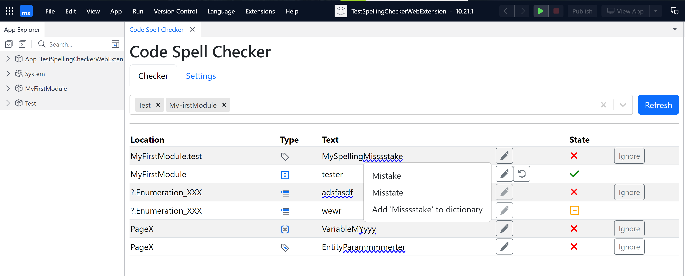

# Code Spell Checker - Studio Pro Extension

Improve code quality by checking spelling in your Mendix Studio Pro project.

## features

- Spell check (all) document names, variables and parameter in the project.
- Supports multiple languages; English (US), English (UK), Dutch
- Spelling suggestions
- Extend dictionary with custom words
- Ignore words
- Select modules and documents types to check




## Limitations

- Only works for Mendix Studio Pro 10.21.0 or later
- Limited to some documentation types
- Removing an Project Dictionary, requires a restart of the extension.
- Mendix BUG, documents are not automatically saved. Requires manual saving from Studio Pro.

## Install for Usage

- Download release, matching your Mendix Studio Pro version.
- Create in the Mendix project a folder named `webextensions`.
- Unzip the `CodeSpellChecker.zip` file.
- Copy the `CodeSpellChecker` folder to the project webextensions folder.

## Running the extension

- Start Studio Pro with the `--enable-extension-development` feature flag.
- Open your Mendix app in Studio Pro and start the spell checker from menu Extensions > Code Spell Checker


## Development

Documentation for development is available at https://docs.mendix.com/apidocs-mxsdk/apidocs/web-extensibility-api/

### Prerequisites

- Node.js (LTS version recommended)
- npm (usually comes with Node.js)
- Mendix Studio Pro (version 10.21.0 or later)

### Development Installation

1. Clone this repository (or fork it to create your own copy):

```bash
   git clone https://github.com/mendix/code-spell-checker-web-extension.git
```

2. Navigate to the project directory:

```bash
   cd code-spell-checker-web-extension
```

3. Install dependencies:

```bash
   npm install
```

### Building the Extension

To build the extension, run:

```bash
npm run build
```

The build output will be located in the `dist/CodeSpellChecker` directory.

## Usage

1. After building, copy the `CodeSpellChecker` directory from `dist` to the `webextensions` directory in your Mendix app project. The resulting structure should be as follows:

```
<app directory>/
  App.mpr
  ...
  webextensions/
    CodeSpellChecker/
      manifest.json
      main.js
      ...
```

The build can copy the `CodeSpellChecker` folder to the project webextensions folder. by creating a file `.env.local` in the root of the project with the following content, and setting the TEST_PROJECT variable to the path of your Mendix project.

> TEST_PROJECT=C://MendixProjects//YourTestProject//webextensions//CodeSpellChecker

### Build, and Debugging

With the additional feature flags you can debug the extension in the studio pro.

Start Studio Pro with the `--enable-extension-development --enable-extension-development --enable-webview-debugging --webview-remote-debugging` feature flags.

When the extension is running and windows is active, you can start the debugger by pressing F12.

For testing, and building the user interface, standalone mocking the Studio API. Run the use the following command:

> npm run uiTest

This will open a new browser window with the extension running on http://localhost:5173/

## Development

We recommend using [Visual Studio Code](https://code.visualstudio.com/) (VSCode) for developing your web extension. VSCode offers excellent support for JavaScript/TypeScript development and has a wide range of helpful extensions.
